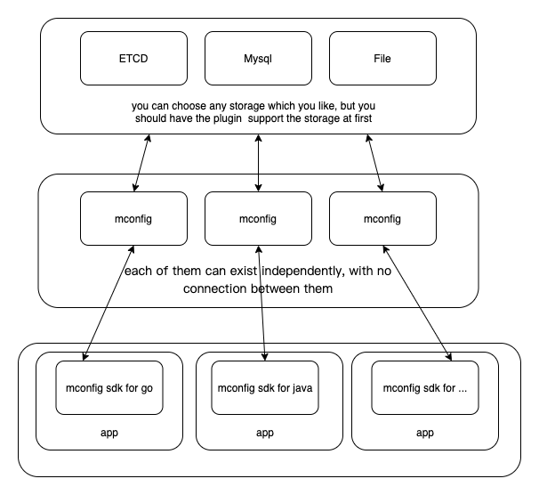

## MConfig

### Related

* [mconfig cli](https://github.com/mhchlib/mconfig-cli)
* [mconfig go sdk](https://github.com/mhchlib/mconfig-go-sdk) 

* [test](/test.md)

### Motivation

​	I need a simple, easy-to-use and stable distributed configuration center, but I don't want it to affect the performance of my app too much.
​	Although there are many open source configuration centers out there, few have been written in Golang, so I wanted to give it a try.

### Feature

* Writing By Golang
* Simple
* Support Namespaces
* Support Limited AB Publish
* Storage Pluggable

### Progress

* The basic functions have been completed
*  A rich storage plug-in is being developed，such file、mysql ...

### Plan

* Support more storage
* Support more language
* Fix bugs

### Bugs

### About Me

A person who loves to write code.

If you want to connect me, you can send a mail.